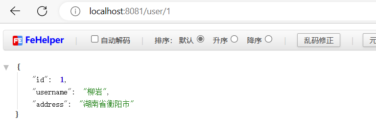
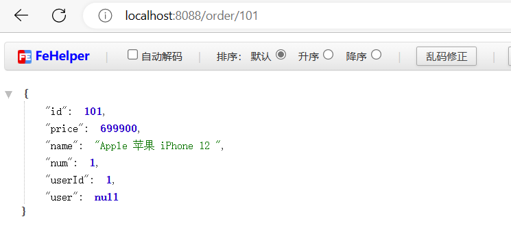
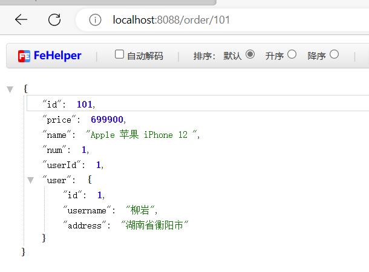

# 服务拆分和远程调用


拆分为俩个服务后，order获取不到user的相关信息了



****


修改order-service中的根据id查询订单业务，要求在查询订单的同时，根据订单中包含的userId查询出用户信息，一起返回。


因此，我们需要在order-service中 向user-service发起一个http的请求，调用http://localhost:8081/user/{userId}这个接口。

大概的步骤是这样的：

- 注册一个RestTemplate的实例到Spring容器
- 修改order-service服务中的OrderService类中的queryOrderById方法，根据Order对象中的userId查询User
- 将查询的User填充到Order对象，一起返回


```java
@MapperScan("cn.itcast.order.mapper")
@SpringBootApplication
public class OrderApplication {

    public static void main(String[] args) {
        SpringApplication.run(OrderApplication.class, args);
    }

    @Bean
    public RestTemplate restTemplate(){
        return new RestTemplate();
    }
}
```


```java
package cn.itcast.order.service;

import cn.itcast.order.mapper.OrderMapper;
import cn.itcast.order.pojo.Order;
import cn.itcast.order.pojo.User;
import org.springframework.beans.factory.annotation.Autowired;
import org.springframework.stereotype.Service;
import org.springframework.web.client.RestTemplate;

@Service
public class OrderService {

    @Autowired
    private OrderMapper orderMapper;

    @Autowired
    private RestTemplate restTemplate;

    public Order queryOrderById(Long orderId) {
        // 1.查询订单
        Order order = orderMapper.findById(orderId);
        // 2.利用RestTemplate发起http请求，查询用户
        // 2.1.url路径
        String url = "http://localhost:8081/user/" + order.getUserId();
        // 2.2.发送http请求，实现远程调用
        User user = restTemplate.getForObject(url, User.class);
        // 3.封装user到Order
        order.setUser(user);
        // 4.返回
        return order;
    }
}
```


`注意order-service下的pojo里面是有User这个类的`

