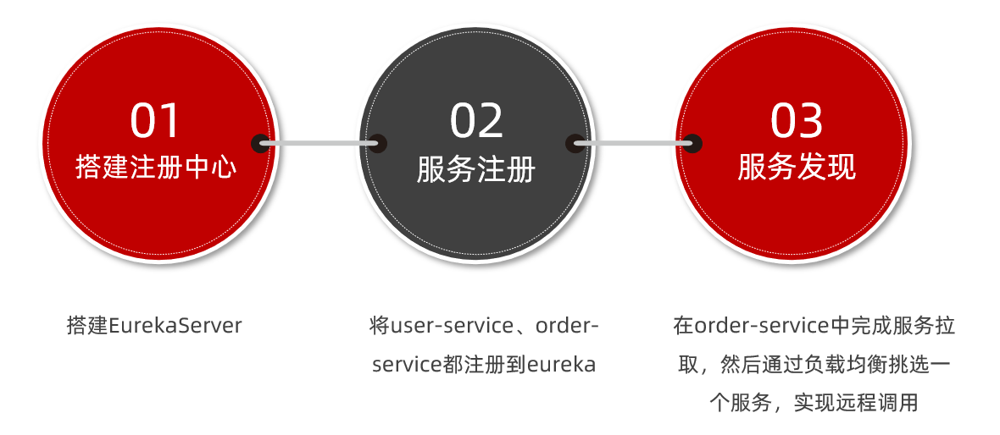
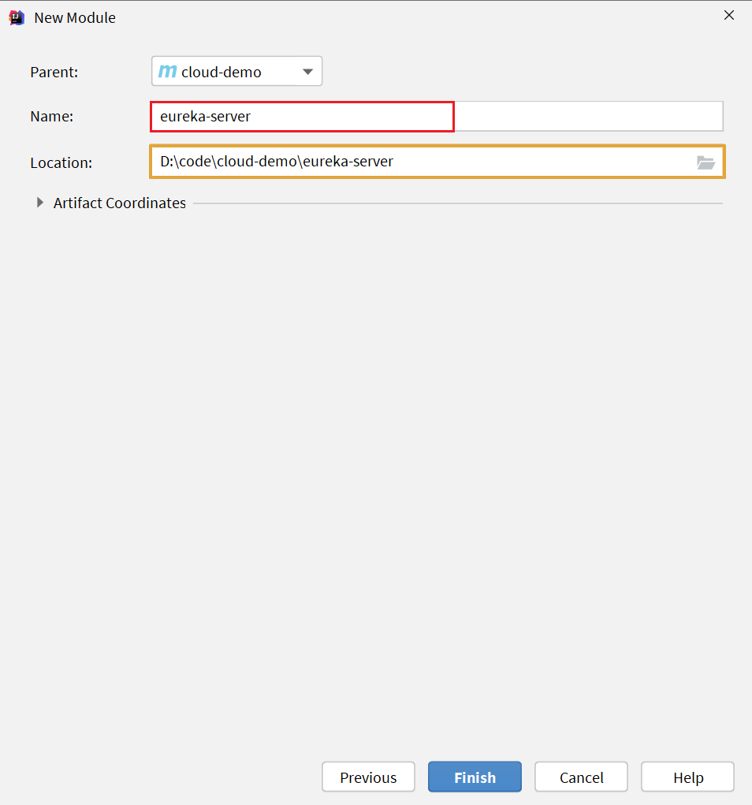
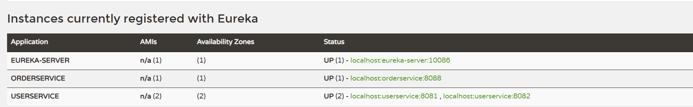

# Eureka注册中心

假如我们的服务提供者user-service部署了多个实例，如图：


大家思考几个问题：

- order-service在发起远程调用的时候，该如何得知user-service实例的ip地址和端口？
- 有多个user-service实例地址，order-service调用时该如何选择？
- order-service如何得知某个user-service实例是否依然健康，是不是已经宕机？


## 3.1.Eureka的结构和作用

这些问题都需要利用SpringCloud中的注册中心来解决，其中最广为人知的注册中心就是Eureka，其结构如下：


回答之前的各个问题。

问题1：order-service如何得知user-service实例地址？

获取地址信息的流程如下：

- user-service服务实例启动后，将自己的信息注册到eureka-server（Eureka服务端）。这个叫服务注册
- eureka-server保存服务名称到服务实例地址列表的映射关系
- order-service根据服务名称，拉取实例地址列表。这个叫服务发现或服务拉取


问题2：order-service如何从多个user-service实例中选择具体的实例？

- order-service从实例列表中利用负载均衡算法选中一个实例地址
- 向该实例地址发起远程调用


问题3：order-service如何得知某个user-service实例是否依然健康，是不是已经宕机？

- user-service会每隔一段时间（默认30秒）向eureka-server发起请求，报告自己状态，称为心跳
- 当超过一定时间没有发送心跳时，eureka-server会认为微服务实例故障，将该实例从服务列表中剔除
- order-service拉取服务时，就能将故障实例排除了


> 注意：一个微服务，既可以是服务提供者，又可以是服务消费者，因此eureka将服务注册、服务发现等功能统一封装到了eureka-client端


因此，接下来我们动手实践的步骤包括：




## 3.2.搭建eureka-server

首先大家注册中心服务端：eureka-server，这必须是一个独立的微服务

### 3.2.1.创建eureka-server服务

在cloud-demo父工程下，创建一个子模块：


填写模块信息：


然后填写服务信息：




### 3.2.2.引入eureka依赖

引入SpringCloud为eureka提供的starter依赖：

```xml
<dependency>
    <groupId>org.springframework.cloud</groupId>
    <artifactId>spring-cloud-starter-netflix-eureka-server</artifactId>
</dependency>
```


### 3.2.3.编写启动类

给eureka-server服务编写一个启动类，一定要添加一个@EnableEurekaServer注解，开启eureka的注册中心功能：

```java
package cn.itcast.eureka;

import org.springframework.boot.SpringApplication;
import org.springframework.boot.autoconfigure.SpringBootApplication;
import org.springframework.cloud.netflix.eureka.server.EnableEurekaServer;

@SpringBootApplication
@EnableEurekaServer
public class EurekaApplication {
    public static void main(String[] args) {
        SpringApplication.run(EurekaApplication.class, args);
    }
}
```


### 3.2.4.编写配置文件

编写一个application.yml文件，内容如下：

```yaml
server:
  port: 10086
spring:
  application:
    name: eureka-server
eureka:
  client:
    service-url: 
      defaultZone: http://127.0.0.1:10086/eureka
```


### 3.2.5.启动服务

启动微服务，然后在浏览器访问：http://127.0.0.1:10086

看到下面结果应该是成功了：


## 3.3.服务注册

下面，我们将user-service注册到eureka-server中去。

### 1）引入依赖

在user-service的pom文件中，引入下面的eureka-client依赖：

```xml
<dependency>
    <groupId>org.springframework.cloud</groupId>
    <artifactId>spring-cloud-starter-netflix-eureka-client</artifactId>
</dependency>
```


### 2）配置文件

在user-service中，修改application.yml文件，添加服务名称、eureka地址：

```yaml
spring:
  application:
    name: userservice
eureka:
  client:
    service-url:
      defaultZone: http://127.0.0.1:10086/eureka
```


### 3）启动多个user-service实例

为了演示一个服务有多个实例的场景，我们添加一个SpringBoot的启动配置，再启动一个user-service。


首先，复制原来的user-service启动配置：


然后，在弹出的窗口中，填写信息：


现在，SpringBoot窗口会出现两个user-service启动配置：


不过，第一个是8081端口，第二个是8082端口。

启动两个user-service实例：


查看eureka-server管理页面：


顺便把orderserive也注册了


## 3.4.服务发现

下面，我们将order-service的逻辑修改：向eureka-server拉取user-service的信息，实现服务发现。

### 1）引入依赖

之前说过，服务发现、服务注册统一都封装在eureka-client依赖，因此这一步与服务注册时一致。

在order-service的pom文件中，引入下面的eureka-client依赖：

```xml
<dependency>
    <groupId>org.springframework.cloud</groupId>
    <artifactId>spring-cloud-starter-netflix-eureka-client</artifactId>
</dependency>
```


### 2）配置文件

服务发现也需要知道eureka地址，因此第二步与服务注册一致，都是配置eureka信息：

在order-service中，修改application.yml文件，添加服务名称、eureka地址：

```yaml
spring:
  application:
    name: orderservice
eureka:
  client:
    service-url:
      defaultZone: http://127.0.0.1:10086/eureka
```


### 3）服务拉取和负载均衡

最后，我们要去eureka-server中拉取user-service服务的实例列表，并且实现负载均衡。

不过这些动作不用我们去做，只需要添加一些注解即可。


在order-service的OrderApplication中，给RestTemplate这个Bean添加一个@LoadBalanced注解：


修改order-service服务中的cn.itcast.order.service包下的OrderService类中的queryOrderById方法。修改访问的url路径，用服务名代替ip、端口：


spring会自动帮助我们从eureka-server端，根据userservice这个服务名称，获取实例列表，而后完成负载均衡。


