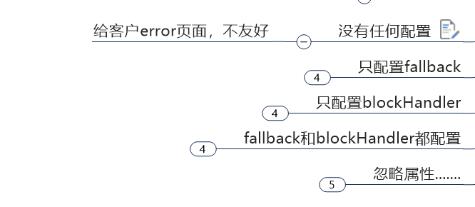

Sentienel

https://sentinelguard.io/zh-cn/docs/quick-start.html

```xml
 <!--SpringCloud alibaba nacos -->
        <dependency>
            <groupId>com.alibaba.cloud</groupId>
            <artifactId>spring-cloud-starter-alibaba-nacos-discovery</artifactId>
        </dependency>
        <!--SpringCloud alibaba sentinel-datasource-nacos 后续做持久化用到-->
        <dependency>
            <groupId>com.alibaba.csp</groupId>
            <artifactId>sentinel-datasource-nacos</artifactId>
        </dependency>
        <!--SpringCloud alibaba sentinel -->
        <dependency>
            <groupId>com.alibaba.cloud</groupId>
            <artifactId>spring-cloud-starter-alibaba-sentinel</artifactId>
        </dependency>
```

控制台

1.下载jar包

2.启动

```
java -Dserver.port=8080 -Dcsp.sentinel.dashboard.server=localhost:8080 -Dproject.name=sentinel-dashboard -jar sentinel-dashboard.jar
```


自定义限流处理逻辑

1.自定义xxxhandler类，里面可以写多个异常处理逻辑

2.配置注解 value资源名字  blockHandler 具体方法  blockHandlerClass 自定义xxxhandler类

```
    @SentinelResource(value = "testHotKey", blockHandler = "deal_testHotkey",blockHandlerClass = {})

```

3.控制台配置规则


fallback管运行异常  Java的异常

blockHandler管配置违规  Sentinel的配置




blockHandler 优先级高


Requested bean is currently in creation: Is there an unresolvable circular reference


版本问题...换这个就不报错了

https://blog.csdn.net/weixin_43325510/article/details/121153962

```
<spring-cloud.version>Hoxton.SR8</spring-cloud.version>
  <dependency>
            <groupId>com.alibaba.cloud</groupId>
            <artifactId>spring-cloud-alibaba-dependencies</artifactId>
            <version>2.2.5.RELEASE</version>
            <type>pom</type>
            <scope>import</scope>
        </dependency>
```

