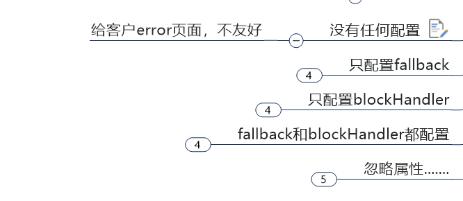

# Sentienel

https://sentinelguard.io/zh-cn/docs/quick-start.html

```xml
 <!--SpringCloud alibaba nacos -->
        <dependency>
            <groupId>com.alibaba.cloud</groupId>
            <artifactId>spring-cloud-starter-alibaba-nacos-discovery</artifactId>
        </dependency>
        <!--SpringCloud alibaba sentinel-datasource-nacos 后续做持久化用到-->
        <dependency>
            <groupId>com.alibaba.csp</groupId>
            <artifactId>sentinel-datasource-nacos</artifactId>
        </dependency>
        <!--SpringCloud alibaba sentinel -->
        <dependency>
            <groupId>com.alibaba.cloud</groupId>
            <artifactId>spring-cloud-starter-alibaba-sentinel</artifactId>
        </dependency>
```

控制台

1.下载jar包

2.启动

```
java -Dserver.port=8080 -Dcsp.sentinel.dashboard.server=localhost:8080 -Dproject.name=sentinel-dashboard -jar sentinel-dashboard.jar
```


自定义限流处理逻辑

1.自定义xxxhandler类，里面可以写多个异常处理逻辑

2.配置注解 value资源名字  blockHandler 具体方法  blockHandlerClass 自定义xxxhandler类

```
    @SentinelResource(value = "testHotKey", blockHandler = "deal_testHotkey",blockHandlerClass = {})

```

3.控制台配置规则


fallback管运行异常  Java的异常

blockHandler管配置违规  Sentinel的配置




blockHandler 优先级高


Requested bean is currently in creation: Is there an unresolvable circular reference


版本问题...换这个就不报错了

https://blog.csdn.net/weixin_43325510/article/details/121153962

```
<spring-cloud.version>Hoxton.SR8</spring-cloud.version>
  <dependency>
            <groupId>com.alibaba.cloud</groupId>
            <artifactId>spring-cloud-alibaba-dependencies</artifactId>
            <version>2.2.5.RELEASE</version>
            <type>pom</type>
            <scope>import</scope>
        </dependency>
```


# Seata(2.0.0)

https://github.com/seata/seata


## 1.安装部署

https://seata.io/zh-cn/docs/ops/deploy-guide-beginner.html

配置文件的修改（将application.example.yml中对应需要的配置拷贝到application.yml中，这里选择db）

```yml
#  Copyright 1999-2019 Seata.io Group.
#
#  Licensed under the Apache License, Version 2.0 (the "License");
#  you may not use this file except in compliance with the License.
#  You may obtain a copy of the License at
#
#  http://www.apache.org/licenses/LICENSE-2.0
#
#  Unless required by applicable law or agreed to in writing, software
#  distributed under the License is distributed on an "AS IS" BASIS,
#  WITHOUT WARRANTIES OR CONDITIONS OF ANY KIND, either express or implied.
#  See the License for the specific language governing permissions and
#  limitations under the License.

server:
  port: 7091

spring:
  application:
    name: seata-server

logging:
  config: classpath:logback-spring.xml
  file:
    path: ${log.home:${user.home}/logs/seata}
  extend:
    logstash-appender:
      destination: 127.0.0.1:4560
    kafka-appender:
      bootstrap-servers: 127.0.0.1:9092
      topic: logback_to_logstash

console:
  user:
    username: seata
    password: seata
seata:
  config:
    # support: nacos, consul, apollo, zk, etcd3
    type: nacos
    nacos:
      server-addr: 127.0.0.1:8848
      namespace:
      group: SEATA_GROUP
      username:
      password:
      context-path:
      ##if use MSE Nacos with auth, mutex with username/password attribute
      #access-key:
      #secret-key:
      data-id: seataServer.properties
  registry:
    # support: nacos, eureka, redis, zk, consul, etcd3, sofa
    type: nacos
    nacos:
      application: seata-server
      server-addr: 127.0.0.1:8848
      group: SEATA_GROUP
      namespace:
      cluster: default
      username:
      password:
      context-path:
      ##if use MSE Nacos with auth, mutex with username/password attribute
      #access-key:
      #secret-key:
  store:
    # support: file 、 db 、 redis 、 raft
    mode: db
    db:
      datasource: druid
      db-type: mysql
      driver-class-name: com.mysql.cj.jdbc.Driver
      url: jdbc:mysql://127.0.0.1:3306/seata?rewriteBatchedStatements=true&useSSL=false&serverTimezone=GMT%2B8
      user: root
      password: Zhou@1010
      min-conn: 10
      max-conn: 100
      global-table: global_table
      branch-table: branch_table
      lock-table: lock_table
      distributed-lock-table: distributed_lock
      query-limit: 1000
      max-wait: 5000
    redis:
      mode: single
      # support: lua 、 pipeline
      type: lua
      database: 0
      min-conn: 10
      max-conn: 100
      password:
      max-total: 100
      query-limit: 1000
      single:
        host: 127.0.0.1
        port: 6379
      sentinel:
        master-name:
        sentinel-hosts:
        sentinel-password:
  #  server:
  #    service-port: 8091 #If not configured, the default is '${server.port} + 1000'
  security:
    secretKey: SeataSecretKey0c382ef121d778043159209298fd40bf3850a017
    tokenValidityInMilliseconds: 1800000
    ignore:
      urls: /,/**/*.css,/**/*.js,/**/*.html,/**/*.map,/**/*.svg,/**/*.png,/**/*.jpeg,/**/*.ico,/api/v1/auth/login,/metadata/v1/**

```

> mysql是8.0的，驱动类需要com.mysql.cj.jdbc.Driver，而不是com.mysql.jdbc.Driver。
>
> 在数据库的连接信息后面需要添加时区配置，否则也会报错

先启动nacos,再启动seata,在nacos的服务列表中有seata-server则成功

## 2.分布式事务业务例子

> 这里我们会创建三个服务，一个订单服务，一个库存服务，一个账户服务。
>
> 当用户下单时，会在订单服务中创建一个订单，然后通过远程调用库存服务来扣减下单商品的库存，
>
> 再通过远程调用账户服务来扣减用户账户里面的余额，
>
> 最后在订单服务中修改订单状态为已完成。
>
> 该操作跨越三个数据库，有两次远程调用，很明显会有分布式事务问题。

https://seata.io/zh-cn/docs/user/quickstart  AT模式

### 建库sql

```
CREATE DATABASE seata_order;

 

CREATE DATABASE seata_storage;

 

CREATE DATABASE seata_account;
```

### 建表sql

#### seata_order

```
CREATE TABLE t_order (

  `id` BIGINT(11) NOT NULL AUTO_INCREMENT PRIMARY KEY,

  `user_id` BIGINT(11) DEFAULT NULL COMMENT '用户id',

  `product_id` BIGINT(11) DEFAULT NULL COMMENT '产品id',

  `count` INT(11) DEFAULT NULL COMMENT '数量',

  `money` DECIMAL(11,0) DEFAULT NULL COMMENT '金额',

  `status` INT(1) DEFAULT NULL COMMENT '订单状态：0：创建中；1：已完结' 

) ENGINE=INNODB AUTO_INCREMENT=7 DEFAULT CHARSET=utf8;


SELECT * FROM t_order;
```

#### seata_storage

```
 

CREATE TABLE t_storage (

 `id` BIGINT(11) NOT NULL AUTO_INCREMENT PRIMARY KEY,

 `product_id` BIGINT(11) DEFAULT NULL COMMENT '产品id',

 `total` INT(11) DEFAULT NULL COMMENT '总库存',

 `used` INT(11) DEFAULT NULL COMMENT '已用库存',

 `residue` INT(11) DEFAULT NULL COMMENT '剩余库存'

) ENGINE=INNODB AUTO_INCREMENT=2 DEFAULT CHARSET=utf8;

 


INSERT INTO seata_storage.t_storage(`id`, `product_id`, `total`, `used`, `residue`)

VALUES ('1', '1', '100', '0', '100');

 

SELECT * FROM t_storage;

 
```

#### seata_account

```
CREATE TABLE t_account (

  `id` BIGINT(11) NOT NULL AUTO_INCREMENT PRIMARY KEY COMMENT 'id',

  `user_id` BIGINT(11) DEFAULT NULL COMMENT '用户id',

  `total` DECIMAL(10,0) DEFAULT NULL COMMENT '总额度',

  `used` DECIMAL(10,0) DEFAULT NULL COMMENT '已用余额',

  `residue` DECIMAL(10,0) DEFAULT '0' COMMENT '剩余可用额度'

) ENGINE=INNODB AUTO_INCREMENT=2 DEFAULT CHARSET=utf8;

 

INSERT INTO seata_account.t_account(`id`, `user_id`, `total`, `used`, `residue`)  VALUES ('1', '1', '1000', '0', '1000');

 

SELECT * FROM t_account;

```

#### undo_log(每个库下单独建)

```
-- 注意此处0.3.0+ 增加唯一索引 ux_undo_log
CREATE TABLE `undo_log` (
  `id` bigint(20) NOT NULL AUTO_INCREMENT,
  `branch_id` bigint(20) NOT NULL,
  `xid` varchar(100) NOT NULL,
  `context` varchar(128) NOT NULL,
  `rollback_info` longblob NOT NULL,
  `log_status` int(11) NOT NULL,
  `log_created` datetime NOT NULL,
  `log_modified` datetime NOT NULL,
  `ext` varchar(100) DEFAULT NULL,
  PRIMARY KEY (`id`),
  UNIQUE KEY `ux_undo_log` (`xid`,`branch_id`)
) ENGINE=InnoDB AUTO_INCREMENT=1 DEFAULT CHARSET=utf8;
```


```
Bean named 'dataSourceProxy' is expected to be of type 'io.seata.rm.datasource.DataSourceProxy' but was actually of type 'com.alibaba.druid.pool.DruidDataSource$$EnhancerBySpringCGLIB$$75ff8cd0'

https://github.com/seata/seata/issues/3805

 @Bean
  public DataSourceProxy dataSourceProxy(DataSource dataSource) {
    return new DataSourceProxy(dataSource);
  }
  #DataSourceProxy 改成 DataSource
```


```
Cause: org.xml.sax.SAXParseException; lineNumber: 2; columnNumber: 6; 不允许有匹配 "[xX][mM][lL]" 的处理指令目标

#xml文件有问题
```


```
Failed to get available servers: service.vgroupMapping.default_tx_group configuration item is required

service.vgroupMapping.default_tx_group configuration item is required

https://github.com/seata/seata-samples/issues/625 #暂时好像无效，还是的在nacos上配置？
```

```
 Failed to get available servers: service.default.grouplist or service.grouplist.default configuration item is require
```

上传配置至Nacos配置中心用dataId来配置

https://seata.io/zh-cn/docs/user/configuration/nacos

或者直接在nacos上新建seataServer.properties

Data ID: seataServer.properties
Group: SEATA_GROUP

```
store.db.datasource=druid
store.db.dbType=mysql
store.db.driverClassName=com.mysql.cj.jdbc.Driver
store.db.url=jdbc:mysql://localhost:3306/seata_order?useUnicode=true&characterEncoding=utf8&characterSetResults=utf8&useSSL=false&serverTimezone=GMT%2B8
store.db.user=root
store.db.password=Zhou@1010
store.db.minConn=5
store.db.maxConn=30
store.db.globalTable=global_table
store.db.branchTable=branch_table
store.db.distributedLockTable=distributed_lock
store.db.queryLimit=100
store.db.lockTable=lock_table
store.db.maxWait=5000

#这两行必需加上，不然报错
#Transaction routing rules configuration, only for the client
service.vgroupMapping.default_tx_group=default
service.default.grouplist=127.0.0.1:8091
```


